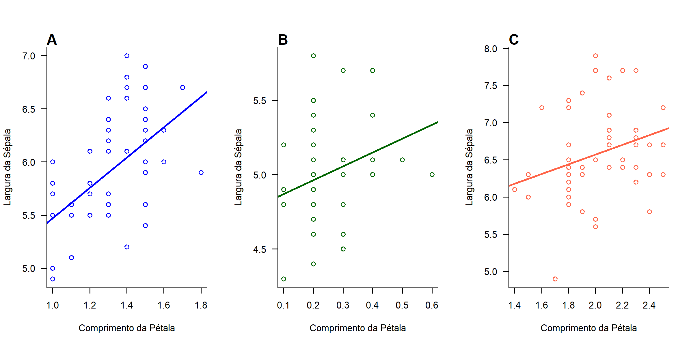

```{r setup, include=FALSE}
knitr::opts_chunk$set(echo = TRUE)
```

# Como criar e editar gráficos no R?

Primeiro, teremos que selecionar um conjunto de dados com o comando ```read.csv```, como mostra o exemplo abaixo. A seguir, utilizamos o comando ```head``` para visualizar a tabela que incluímos. 

```{r ler_dados}
data(iris)
head(iris)
```

Agora iremos fazer uma análise de Modelo Linear, onde precisamos criar um objeto para realizar esta análise para espécie da tabela iris. Neste modelo, iremos observar a largura da sépala em função do comprimento da pétala.

``` {r lm}
mv <- lm(Sepal.Length ~ Petal.Width, data=iris[iris$Species=="versicolor",])
ms <- lm(Sepal.Length ~ Petal.Width, data=iris[iris$Species=="setosa",])
mvi <-lm(Sepal.Length ~ Petal.Width, data=iris[iris$Species=="virginica",])
#calculando o coeficiente e interseção de cada conjunto de dados
coefv <- coef(mv)
coefs <- coef(ms)
coefvi <- coef(mvi)
```

Para facilitar, criaremos dois objetos para nomear os eixos do gráfico.

```{r objetos}
labx <- "Comprimento da Pétala"
laby <- "Largura da Sépala"
```

Construindo o gráfico, iremos utilizar a função ```par(mfrow)``` para colocar os gráficos de cada espécie em uma mesma janela gráfica e definir seus parâmetros. Todas as informações serão apicadas a todos os gráficos produzidos. Em seguida, iremos plotar as informações com o comando ```plot``` e a linha de regressão.

```{r plot, eval=F}

png("figs/figura05.png", res=300, width=2400, height=1200) #Essa função deverá ser feita ao início de todo processo de produção do gráfico, pois irá possibilitar uma imagem com os comandos escritos posteriormente. Nesta função teremos que ditar o caminho do arquivo, a resolução em dpi (res=), comprimento (width=), altura (height=).


par(mfrow=c(1,3), las=1, bty="l") #onde o argumento las significa alteração dos números do eixo y e bty significa o gráfico em L.

#___________________espécie I. versicolor

plot(Sepal.Length ~ Petal.Width, data=iris[iris$Species=="versicolor",],
     col= "blue",
     ylab=laby, xlab=labx)

abline(a=coefv[1], b=coefv[2],
       col='blue', lwd=2)

#rótulo do gráfico = A

mtext("A", 3, adj=0, font=2)

#___________________espécie I. setosa

plot(Sepal.Length ~ Petal.Width, data=iris[iris$Species=="setosa",],
     col= "dark green",
     ylab=laby, xlab=labx)

abline(a=coefs[1], b=coefs[2],
       col='dark green', lwd=2)

mtext("B", 3, adj=0, font=2)

#___________________espécie I. virginica

plot(Sepal.Length ~ Petal.Width, data=iris[iris$Species=="virginica",],
     col= "tomato",
     ylab=laby, xlab=labx)

abline(a=coefvi[1], b=coefvi[2],
       col='tomato', lwd=2)

mtext("C", 3, adj=0, font=2)


#Ao final de todas as funções para produzir os gráficos, devemos utilizar essa função para salvar em formato de png:
dev.off()

```

O resultado que irá aparecer deve ser similar a estes gráficos:

```{r pressure, echo=FALSE, out.width = '100%'}



```


